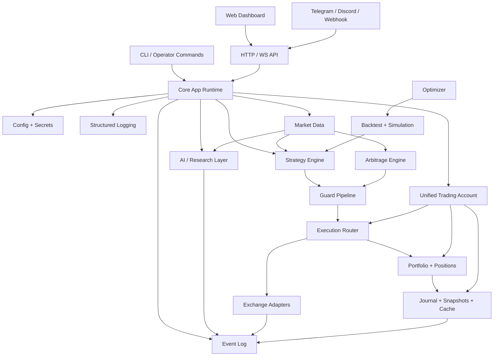

# Go Ultra-Project Architecture

## Executive Summary
The audit supports a split conclusion:

- **Architectural reference winner:** `TraderAlice/OpenAlice`
- **Implementation/kernel winner:** `c9s/bbgo`

The recommended direction is therefore:

> Build the new system in Go using a **BBGO-like trading kernel** and layer on **OpenAlice-style domain boundaries, orchestration, account abstraction, event logging, and connector patterns**.

This avoids the biggest risks:
- rewriting around a TypeScript-first runtime,
- importing a monolithic or tightly coupled bot design,
- anchoring the project to one giant script or one exchange-oriented implementation.

## Architecture Selection Rationale

### Why OpenAlice wins architecture
OpenAlice shows the cleanest system design among the imported projects:
- composition root,
- explicit `core/`, `domain/`, `tool/`, `connectors/`, `server/`, `task/` separation,
- account-centric abstraction,
- event log as first-class infrastructure,
- broker isolation behind unified account behavior,
- runtime pluggability.

It behaves more like a platform than a bot.

### Why BBGO wins implementation base
BBGO is already:
- written in Go,
- large enough to prove scalability,
- rich in exchange, orderbook, strategy, indicator, execution, optimization, and backtest functionality,
- structured around exchange/session/strategy abstractions,
- deployable and operationally mature.

It is the best practical foundation for a large Go trading project.

## Architectural Principles
- **Kernel first**: market data, accounts, orders, positions, and exchange adapters are the center.
- **Domain isolation**: research, strategy, risk, execution, connectors, and AI live in separate modules.
- **Capability-driven adapters**: exchanges advertise what they support rather than pretending all exchanges are equal.
- **Event-first coordination**: key system actions publish durable events.
- **Guard-before-execution**: all orders pass a risk/validation pipeline.
- **Clean-room assimilation**: reimplement ideas, do not blindly merge source.
- **Streaming + snapshot model**: live feeds for immediacy, snapshots/journals for durability.

## Proposed Top-Level Structure

```text
ultratrader/
├── cmd/
│   ├── ultratrader/
│   └── ultratraderd/
├── internal/
│   ├── core/
│   ├── exchange/
│   ├── marketdata/
│   ├── trading/
│   ├── strategy/
│   ├── indicator/
│   ├── risk/
│   ├── backtest/
│   ├── optimizer/
│   ├── arbitrage/
│   ├── lending/
│   ├── research/
│   ├── ai/
│   ├── notifications/
│   ├── connectors/
│   └── persistence/
├── web/
├── api/
├── sdk/
├── deployments/
└── docs/
```

## Mermaid Overview



## Core Subsystems

### 1. Core Runtime
Responsibilities:
- app lifecycle,
- dependency wiring,
- startup/shutdown,
- config load and validation,
- service registration,
- background worker supervision.

Inspirations:
- OpenAlice `main.ts`, `core/`, `connector-center`, `event-log`.

### 2. Unified Trading Account
A direct architectural descendant of the OpenAlice UTA concept, but in Go.

Each account owns:
- broker/exchange connections,
- order and position state,
- guard configuration,
- execution history,
- snapshots,
- enable/disable lifecycle.

This becomes the unit of isolation for:
- strategies,
- risk rules,
- credentials,
- journals,
- dashboards.

### 3. Exchange Layer
A BBGO-like exchange abstraction enriched by CCXT-style capabilities.

Every adapter should expose:
- markets,
- balances,
- orders,
- orderbook,
- tickers,
- trades,
- candles,
- websocket support flags,
- margin/futures support flags,
- precision/min-size metadata.

Recommended design:
- base interfaces for spot,
- optional sub-interfaces for margin/futures/lending,
- capability registry rather than massive optional structs.

### 4. Market Data Layer
Responsibilities:
- live trade feeds,
- ticker feeds,
- orderbook streams,
- candle aggregation,
- historical data ingestion,
- cache and replay.

Inspirations:
- BBGO streaming integrations,
- WolfBot real-time websocket processing,
- CCXT normalization patterns.

### 5. Strategy Engine
A composable event-driven system.

Required support:
- built-in strategies,
- custom strategies,
- indicator pipelines,
- multi-timeframe composition,
- signal chaining,
- simulation mode,
- strategy telemetry.

Inspirations:
- BBGO built-in strategies and indicators,
- WolfBot strategy-event chaining,
- PowerTrader Thinker signal model.

### 6. Risk / Guard Pipeline
Every execution request passes through ordered guards.

Minimum guards:
- account enabled,
- symbol allowed,
- max notional,
- max open exposure,
- cooldown,
- duplicate-order prevention,
- leverage/margin eligibility,
- exchange capability check.

Inspirations:
- OpenAlice guards,
- PowerTrader risk management and rebalancer concepts.

### 7. Execution Router
Responsibilities:
- convert strategy intents into exchange-native orders,
- route to best venue where relevant,
- reconcile exchange responses,
- update journals,
- publish events.

Potential later enhancements:
- smart order routing,
- split fills,
- TWAP/VWAP execution,
- cross-exchange routing.

### 8. Backtest + Optimizer
Must be first-class, not bolted on.

Requirements:
- deterministic candle replay,
- paper execution model,
- cost/slippage modeling,
- parameter sweeps,
- optimization hooks,
- report generation.

Inspirations:
- BBGO backtesting and optimizer,
- WolfBot parameter optimization,
- PowerTrader backtester.

### 9. Event Log and Persistence
Persistence should be layered:
- append-only event log,
- trade journal,
- snapshots,
- lightweight relational store where useful,
- local file-backed mode for simple setups.

This follows OpenAlice’s event-first approach while retaining pragmatism for trading workloads.

### 10. AI / Research Layer
This should be optional and modular.

Responsibilities:
- market research tools,
- summarization,
- signal explanation,
- optional planning agents,
- news/sentiment ingestion,
- reasoning workflow.

The AI layer must not be required for the trading kernel to function.

## What to Assimilate from Key Projects

### From BBGO
- Go-native exchange/session abstractions,
- strategy packaging,
- indicator library structure,
- optimization hooks,
- backtesting core,
- dashboard/deployment patterns.

### From OpenAlice
- account-centered architecture,
- event log,
- connector center,
- broker registry/config schema approach,
- strong separation of core/domain/tooling.

### From CCXT
- exchange metadata normalization,
- capability discovery,
- symbol/market conventions,
- broad exchange coverage model.

### From WolfBot
- strategy event forwarding,
- deep feature surface,
- arbitrage and advanced trading mode decomposition,
- real-time stream emphasis.

### From PowerTrader AI
- practical retail UX ideas,
- DCA/risk dashboard concepts,
- analytics journal integration,
- volume/correlation/risk overlays,
- tight desktop-style operator workflow.

## What Not to Inherit
- mandatory monolithic scripts,
- hidden startup side effects on import,
- ad hoc global state,
- exchange-specific logic leaking into strategy code,
- UI frameworks tightly coupled to execution internals,
- unclear or incompatible licensing assumptions.

## Recommended Naming Model
Potential project names:
- `ultratrader-go`
- `powertrader-go`
- `atlas-trader`
- `bobtrader-go`

Short-term docs in this repo can remain under “Go Ultra-Project.”

## Architecture Decision Summary
1. **Use BBGO-style Go trading kernel as the base implementation reference.**
2. **Use OpenAlice architecture patterns as the system-organization reference.**
3. **Treat CCXT as exchange-abstraction reference, not as the base architecture.**
4. **Assimilate WolfBot features selectively into dedicated modules, not wholesale.**
5. **Implement by phased clean-room re-creation, not source copy-paste.**
